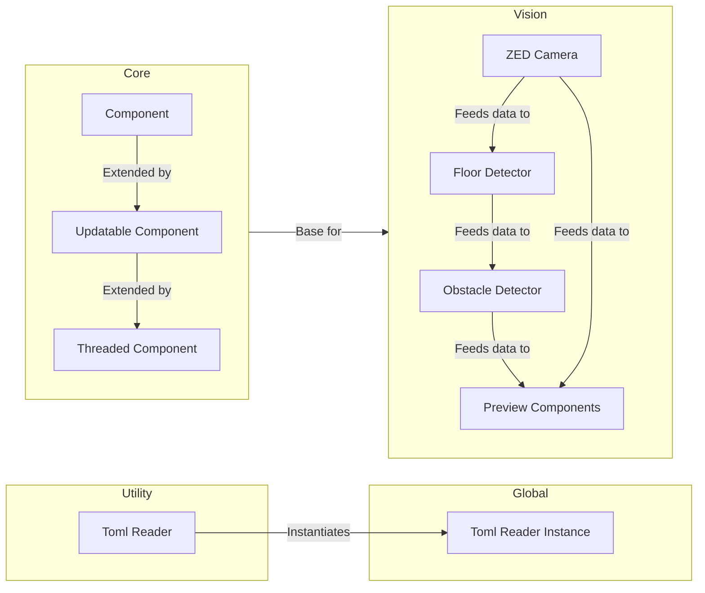

# Codebase Overview

## System Architecture

The Autonomous Control System is organized into three main namespaces, each providing distinct functionality.

```mermaid
graph LR
    subgraph global["Global"]
        toml_reader_instance["Toml Reader Instance"]
    end

    subgraph core["Core"]
        component["Component"]
        updatable["Updatable Component"]
        threaded["Threaded Component"]

        component -->|Extended by| updatable
        updatable -->|Extended by| threaded
    end

    subgraph utility["Utility"]
        toml["Toml Reader"]
    end

    subgraph vision["Vision"]
        zed["ZED Camera"]
        floor["Floor Detector"]
        obstacle["Obstacle Detector"]
        previews["Preview Components"]

        zed -->|Feeds data to| floor
        floor -->|Feeds data to| obstacle
        obstacle -->|Feeds data to| previews
        zed -->|Feeds data to| previews
    end

    core -->|Base for| vision
    toml -->|Instantiates| toml_reader_instance
```
