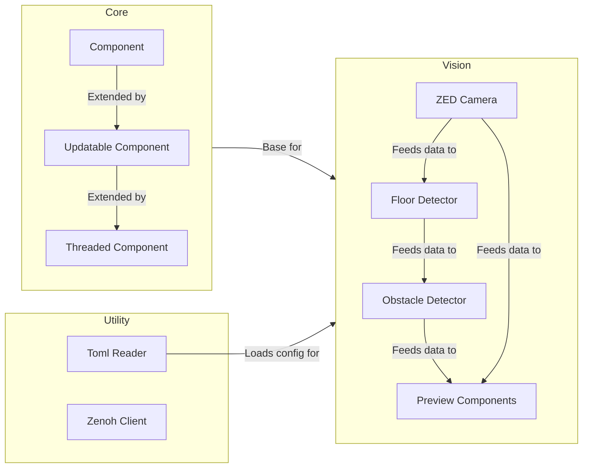

# Codebase Overview

## System Architecture

The Autonomous Control System is organized into three main namespaces, each providing distinct functionality.

See the generated [Namespace Index](namespaces/index.md) for the inheritance hierarchy and namespace-level documentation map.

