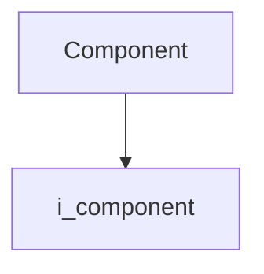
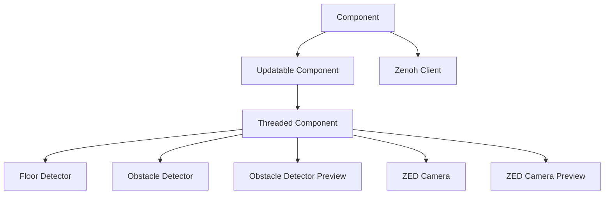

# Component

- **Class**: `component`
- **Namespace**: `acs::core`
- **Include**: `#include "core/implementation/component.h"`

## Overview

Concrete implementation of [`i_component`](../interfaces/i_component.md). Provides the base component with name management and setup/teardown lifecycle.

## Inheritance Diagram

### Base Diagram



### Derived Diagram



## Inheritance Hierarchy

### Base Hierarchy

- [`Component`](component.md)
  - [`i_component`](../interfaces/i_component.md)

### Derived Hierarchy

- [`Component`](component.md)
  - [`Updatable Component`](updatable_component.md)
    - [`Threaded Component`](threaded_component.md)
      - [`Floor Detector`](../../vision/implementation/detection/floor_detector.md)
      - [`Obstacle Detector`](../../vision/implementation/detection/obstacle_detector.md)
      - [`Obstacle Detector Preview`](../../vision/implementation/previews/obstacle_detector_preview.md)
      - [`ZED Camera`](../../vision/implementation/zed_camera.md)
      - [`ZED Camera Preview`](../../vision/implementation/previews/zed_camera_preview.md)
  - [`Zenoh Client`](../../utility/implementation/zenoh_client.md)

## API

### Constructors
#### Constructor

```cpp
explicit component(std::string_view name, std::shared_ptr<utility::i_toml_reader> toml_reader_ptr);
```
Creates a component with the specified name.

##### Parameters
- `name`: The name of the component.
- `toml_reader_ptr`: A shared pointer to a TOML reader for configuration.

### Public Methods

#### Implementations
- [`i_component`](../interfaces/i_component.md)
    - [`setup`](../interfaces/i_component.md#setup)
    - [`teardown`](../interfaces/i_component.md#teardown)
    - [`get_name`](../interfaces/i_component.md#get-name)
    - [`get_is_setup_completed`](../interfaces/i_component.md#get-is-setup-completed)

### Protected Methods
#### On Setup

```cpp
virtual void on_setup() = 0;
```
Called during the setup phase.

!!! note
    Pure virtual method, must be implemented by derived classes.
#### On Teardown

```cpp
virtual void on_teardown() = 0;
```
Called during the teardown phase.

!!! note
    Pure virtual method, must be implemented by derived classes.
#### Get TOML Reader

```cpp
[[nodiscard]] std::shared_ptr<utility::i_toml_reader> get_toml_reader() const noexcept;
```
Returns the TOML reader.
