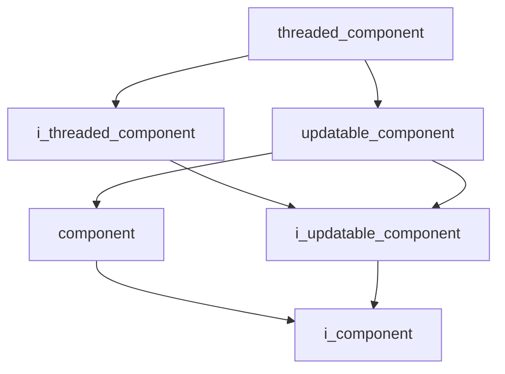
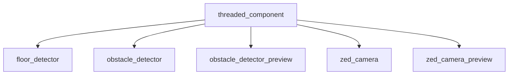

# Threaded Component

- **Class**: `threaded_component`
- **Namespace**: `acs::core`
- **Include**: `#include "core/implementation/threaded_component.h"`

## Overview

Base class for components that execute on a dedicated thread. Extends [`updatable_component`](updatable_component.md) and implements [`i_threaded_component`](../interfaces/i_threaded_component.md), managing thread lifecycle and update-rate timing.

## Inheritance Diagram

### Base Diagram



### Derived Diagram



## Inheritance Hierarchy

### Base Hierarchy

- [`threaded_component`](threaded_component.md)
  - [`i_threaded_component`](../interfaces/i_threaded_component.md)
    - [`i_updatable_component`](../interfaces/i_updatable_component.md)
      - [`i_component`](../interfaces/i_component.md)
  - [`updatable_component`](updatable_component.md)
    - [`component`](component.md)
      - [`i_component`](../interfaces/i_component.md)
    - [`i_updatable_component`](../interfaces/i_updatable_component.md)
      - [`i_component`](../interfaces/i_component.md)

### Derived Hierarchy

- [`threaded_component`](threaded_component.md)
  - [`floor_detector`](../../vision/implementation/detection/floor_detector.md)
  - [`obstacle_detector`](../../vision/implementation/detection/obstacle_detector.md)
  - [`obstacle_detector_preview`](../../vision/implementation/previews/obstacle_detector_preview.md)
  - [`zed_camera`](../../vision/implementation/zed_camera.md)
  - [`zed_camera_preview`](../../vision/implementation/previews/zed_camera_preview.md)

## API

### Constructors
#### Constructor

```cpp
explicit threaded_component(std::string_view name, std::shared_ptr<utility::i_toml_reader> toml_reader_ptr);
```
Creates a threaded component with the specified name.

##### Parameters
- `name`: The name of the component.
- `toml_reader_ptr`: A shared pointer to a TOML reader for configuration.

### Public Methods

#### Implementations
- [`i_threaded_component`](../interfaces/i_threaded_component.md)
    - [`begin`](../interfaces/i_threaded_component.md#begin)
    - [`end`](../interfaces/i_threaded_component.md#end)
    - [`cancel_begin`](../interfaces/i_threaded_component.md#cancel-begin)
    - [`get_update_rate`](../interfaces/i_threaded_component.md#get-update-rate)
    - [`set_update_rate`](../interfaces/i_threaded_component.md#set-update-rate)
    - [`get_is_running`](../interfaces/i_threaded_component.md#get-is-running)
    - [`get_mutex`](../interfaces/i_threaded_component.md#get-mutex)

### Protected Methods
#### On Setup

```cpp
void on_setup() override;
```
Reads the configured update rate and prepares the thread.
#### On Teardown

```cpp
void on_teardown() override;
```
Signals the thread to stop and waits for it to join.
