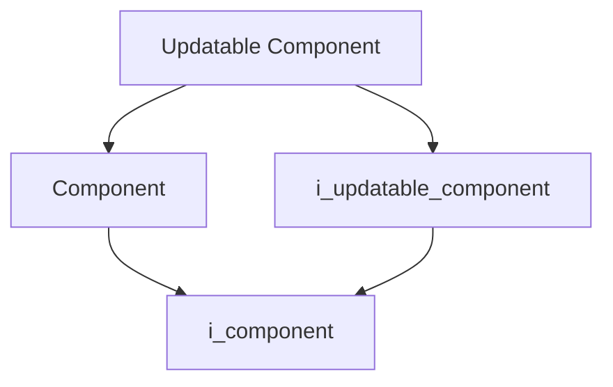
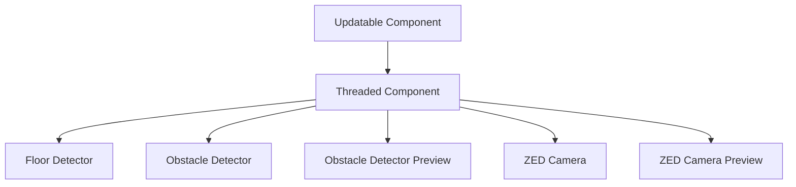

# Updatable Component

- **Class**: `updatable_component`
- **Namespace**: `acs::core`
- **Include**: `#include "core/implementation/updatable_component.h"`

## Overview

Concrete implementation of [`i_updatable_component`](../interfaces/i_updatable_component.md). Extends [`component`](component.md) and adds a single `update()` cycle.

## Inheritance Diagram

### Base Diagram



### Derived Diagram



## Inheritance Hierarchy

### Base Hierarchy

- [`Updatable Component`](updatable_component.md)
  - [`Component`](component.md)
    - [`i_component`](../interfaces/i_component.md)
  - [`i_updatable_component`](../interfaces/i_updatable_component.md)
    - [`i_component`](../interfaces/i_component.md)

### Derived Hierarchy

- [`Updatable Component`](updatable_component.md)
  - [`Threaded Component`](threaded_component.md)
    - [`Floor Detector`](../../vision/implementation/detection/floor_detector.md)
    - [`Obstacle Detector`](../../vision/implementation/detection/obstacle_detector.md)
    - [`Obstacle Detector Preview`](../../vision/implementation/previews/obstacle_detector_preview.md)
    - [`ZED Camera`](../../vision/implementation/zed_camera.md)
    - [`ZED Camera Preview`](../../vision/implementation/previews/zed_camera_preview.md)

## API

### Constructors
#### Constructor

```cpp
explicit updatable_component(std::string_view name, std::shared_ptr<utility::i_toml_reader> toml_reader_ptr);
```
Creates an updatable component with the specified name.

##### Parameters
- `name`: The name of the component.
- `toml_reader_ptr`: A shared pointer to a TOML reader for configuration.

### Public Methods

#### Implementations
- [`i_updatable_component`](../interfaces/i_updatable_component.md)
    - [`update`](../interfaces/i_updatable_component.md#update)

### Protected Methods
#### On Update

```cpp
virtual void on_update() = 0;
```
Calls `on_update()` to execute one update step.

!!! note
    Pure virtual method, must be implemented by derived classes.
