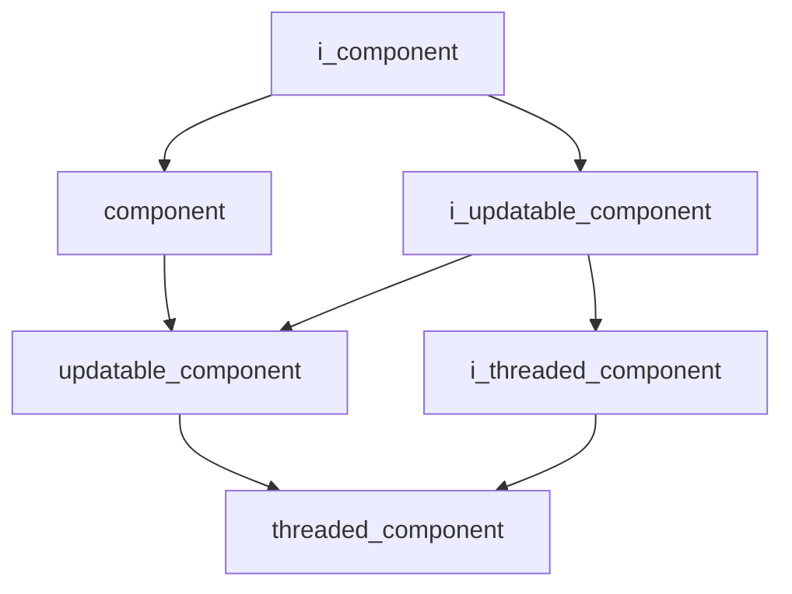

# Core Namespace

## Overview

The `acs::core` namespace provides the foundational component system for the autonomous control system. It defines interfaces and base classes for managing component lifecycles, updates, and threaded execution.

## Inheritance Hierarchy

