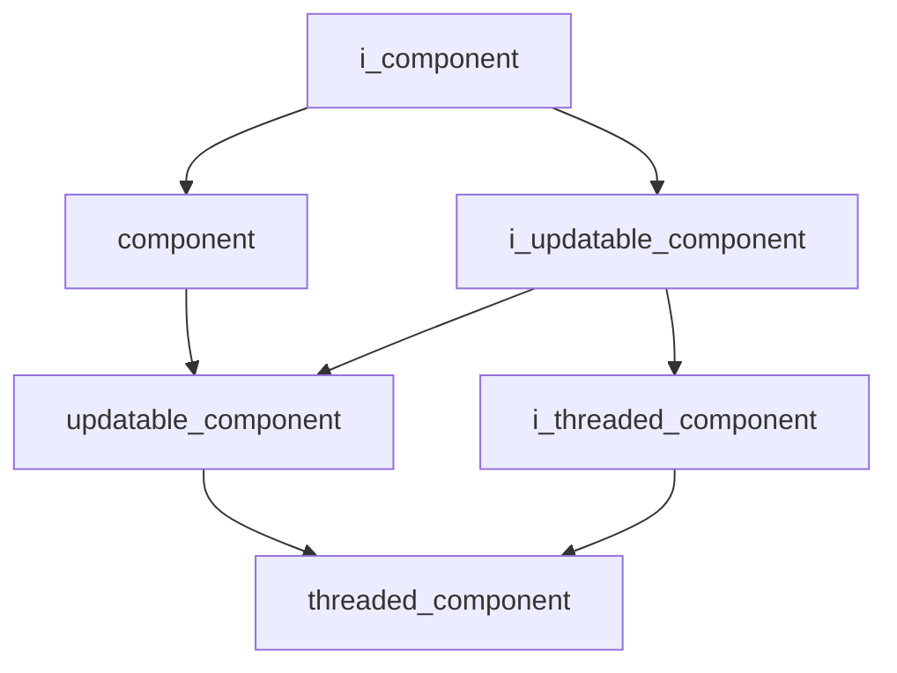

# Core Namespace

## Overview

The `acs::core` namespace provides the foundational component system for the autonomous control system. It defines interfaces and base classes for managing component lifecycles, updates, and threaded execution.

## Namespace Contents

### Interfaces

- [i_component](interfaces/i_component.md)
- [i_threaded_component](interfaces/i_threaded_component.md)
- [i_updatable_component](interfaces/i_updatable_component.md)

### Implementations

- [component](implementation/component.md)
- [threaded_component](implementation/threaded_component.md)
- [updatable_component](implementation/updatable_component.md)

## Inheritance Hierarchy

