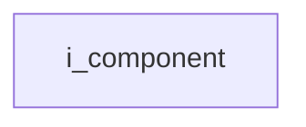
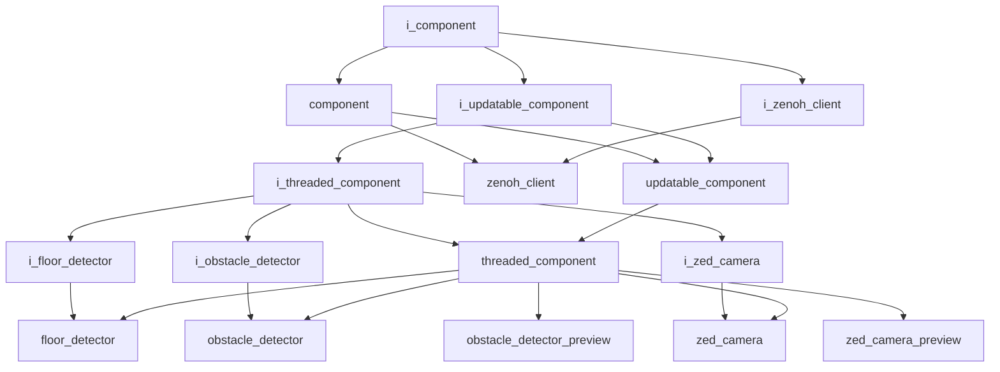

# Component Interface

- **Interface**: `i_component`
- **Namespace**: `acs::core`
- **Include**: `#include "core/interfaces/i_component.h"`

## Overview

Base interface for all components. Defines the setup/teardown lifecycle and name accessors that every component must implement.

## Inheritance Diagram

### Base Diagram



### Derived Diagram



## Inheritance Hierarchy

### Derived Hierarchy

- [`i_component`](i_component.md)
  - [`component`](../implementation/component.md)
    - [`updatable_component`](../implementation/updatable_component.md)
      - [`threaded_component`](../implementation/threaded_component.md)
        - [`floor_detector`](../../vision/implementation/detection/floor_detector.md)
        - [`obstacle_detector`](../../vision/implementation/detection/obstacle_detector.md)
        - [`obstacle_detector_preview`](../../vision/implementation/previews/obstacle_detector_preview.md)
        - [`zed_camera`](../../vision/implementation/zed_camera.md)
        - [`zed_camera_preview`](../../vision/implementation/previews/zed_camera_preview.md)
    - [`zenoh_client`](../../utility/implementation/zenoh_client.md)
  - [`i_updatable_component`](i_updatable_component.md)
    - [`i_threaded_component`](i_threaded_component.md)
      - [`i_floor_detector`](../../vision/interfaces/detection/i_floor_detector.md)
        - [`floor_detector`](../../vision/implementation/detection/floor_detector.md)
      - [`i_obstacle_detector`](../../vision/interfaces/detection/i_obstacle_detector.md)
        - [`obstacle_detector`](../../vision/implementation/detection/obstacle_detector.md)
      - [`i_zed_camera`](../../vision/interfaces/i_zed_camera.md)
        - [`zed_camera`](../../vision/implementation/zed_camera.md)
      - [`threaded_component`](../implementation/threaded_component.md)
        - [`floor_detector`](../../vision/implementation/detection/floor_detector.md)
        - [`obstacle_detector`](../../vision/implementation/detection/obstacle_detector.md)
        - [`obstacle_detector_preview`](../../vision/implementation/previews/obstacle_detector_preview.md)
        - [`zed_camera`](../../vision/implementation/zed_camera.md)
        - [`zed_camera_preview`](../../vision/implementation/previews/zed_camera_preview.md)
    - [`updatable_component`](../implementation/updatable_component.md)
      - [`threaded_component`](../implementation/threaded_component.md)
        - [`floor_detector`](../../vision/implementation/detection/floor_detector.md)
        - [`obstacle_detector`](../../vision/implementation/detection/obstacle_detector.md)
        - [`obstacle_detector_preview`](../../vision/implementation/previews/obstacle_detector_preview.md)
        - [`zed_camera`](../../vision/implementation/zed_camera.md)
        - [`zed_camera_preview`](../../vision/implementation/previews/zed_camera_preview.md)
  - [`i_zenoh_client`](../../utility/interfaces/i_zenoh_client.md)
    - [`zenoh_client`](../../utility/implementation/zenoh_client.md)

## API

### Public Methods
#### Setup

```cpp
virtual void setup() = 0;
```
Initializes the component.

!!! note
    Pure virtual method, must be implemented by derived classes.
#### Teardown

```cpp
virtual void teardown() = 0;
```
Cleans up the component before destruction.

!!! note
    Pure virtual method, must be implemented by derived classes.
#### Get Name

```cpp
[[nodiscard]] virtual std::string_view get_name() const noexcept = 0;
```
Returns the name.

!!! note
    Pure virtual method, must be implemented by derived classes.
#### Get Is Setup Completed

```cpp
[[nodiscard]] virtual bool get_is_setup_completed() const noexcept = 0;
```
Returns whether the setup process has been completed.

!!! note
    Pure virtual method, must be implemented by derived classes.
