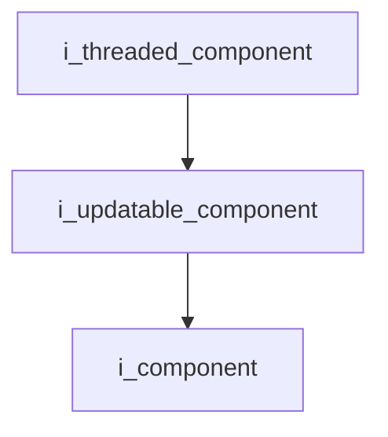
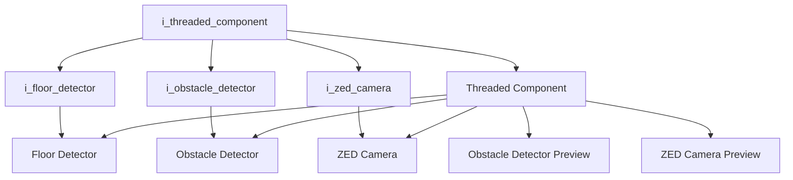

`Interface`

# Threaded Component

- **Interface**: `i_threaded_component`
- **Namespace**: `acs::core`
- **Include**: `#include "core/interfaces/i_threaded_component.h"`

## Overview

Interface for components that run their update loop on a dedicated thread. Extends [`i_updatable_component`](i_updatable_component.md) and adds thread start/stop control and mutex access.

## Inheritance Diagram

### Base Diagram



### Derived Diagram



## Inheritance Hierarchy

### Base Hierarchy

- [`i_threaded_component`](i_threaded_component.md)
  - [`i_updatable_component`](i_updatable_component.md)
    - [`i_component`](i_component.md)

### Derived Hierarchy

- [`i_threaded_component`](i_threaded_component.md)
  - [`i_floor_detector`](../../vision/interfaces/detection/i_floor_detector.md)
    - [`Floor Detector`](../../vision/implementation/detection/floor_detector.md)
  - [`i_obstacle_detector`](../../vision/interfaces/detection/i_obstacle_detector.md)
    - [`Obstacle Detector`](../../vision/implementation/detection/obstacle_detector.md)
  - [`i_zed_camera`](../../vision/interfaces/i_zed_camera.md)
    - [`ZED Camera`](../../vision/implementation/zed_camera.md)
  - [`Threaded Component`](../implementation/threaded_component.md)
    - [`Floor Detector`](../../vision/implementation/detection/floor_detector.md)
    - [`Obstacle Detector`](../../vision/implementation/detection/obstacle_detector.md)
    - [`Obstacle Detector Preview`](../../vision/implementation/previews/obstacle_detector_preview.md)
    - [`ZED Camera`](../../vision/implementation/zed_camera.md)
    - [`ZED Camera Preview`](../../vision/implementation/previews/zed_camera_preview.md)

## API

### Public Methods
#### Begin

```cpp
virtual void begin() = 0;
```
Starts the component thread.

!!! note
    Pure virtual method, must be implemented by derived classes.
#### End

```cpp
virtual void end() = 0;
```
Stops the component thread and waits for it to finish.

!!! note
    Pure virtual method, must be implemented by derived classes.
#### Cancel Begin

```cpp
virtual void cancel_begin() = 0;
```
Cancels a pending begin operation.

!!! note
    Pure virtual method, must be implemented by derived classes.
#### Get Update Rate

```cpp
[[nodiscard]] virtual float get_update_rate() const noexcept = 0;
```
Returns the update rate.

!!! note
    Pure virtual method, must be implemented by derived classes.
#### Set Update Rate

```cpp
virtual void set_update_rate(float update_rate) = 0;
```
Sets the update rate.

##### Parameters
- `update_rate`: The update rate.

!!! note
    Pure virtual method, must be implemented by derived classes.
#### Get Is Running

```cpp
[[nodiscard]] virtual bool get_is_running() const noexcept = 0;
```
Returns whether the component is running.

!!! note
    Pure virtual method, must be implemented by derived classes.
#### Get Mutex

```cpp
[[nodiscard]] virtual std::mutex &get_mutex() = 0;
```
Returns the mutex.

!!! note
    Pure virtual method, must be implemented by derived classes.
