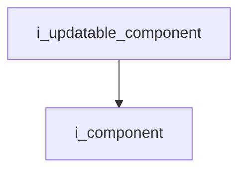
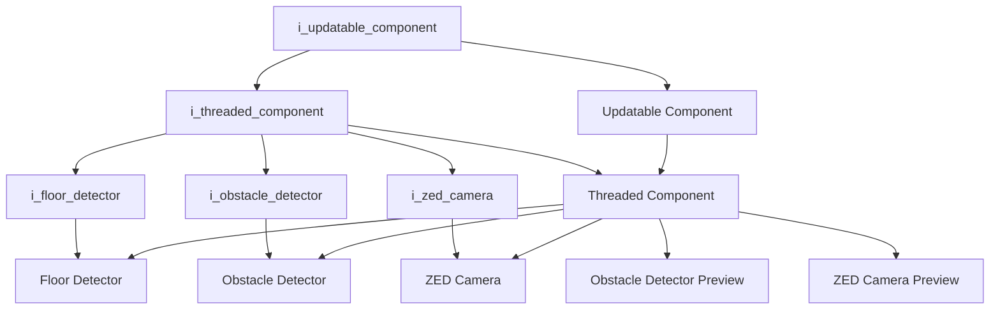

`Interface`

# Updatable Component

- **Interface**: `i_updatable_component`
- **Namespace**: `acs::core`
- **Include**: `#include "core/interfaces/i_updatable_component.h"`

## Overview

Interface for components that support a repeated update cycle. Extends [`i_component`](i_component.md).

## Inheritance Diagram

### Base Diagram



### Derived Diagram



## Inheritance Hierarchy

### Base Hierarchy

- [`i_updatable_component`](i_updatable_component.md)
  - [`i_component`](i_component.md)

### Derived Hierarchy

- [`i_updatable_component`](i_updatable_component.md)
  - [`i_threaded_component`](i_threaded_component.md)
    - [`i_floor_detector`](../../vision/interfaces/detection/i_floor_detector.md)
      - [`Floor Detector`](../../vision/implementation/detection/floor_detector.md)
    - [`i_obstacle_detector`](../../vision/interfaces/detection/i_obstacle_detector.md)
      - [`Obstacle Detector`](../../vision/implementation/detection/obstacle_detector.md)
    - [`i_zed_camera`](../../vision/interfaces/i_zed_camera.md)
      - [`ZED Camera`](../../vision/implementation/zed_camera.md)
    - [`Threaded Component`](../implementation/threaded_component.md)
      - [`Floor Detector`](../../vision/implementation/detection/floor_detector.md)
      - [`Obstacle Detector`](../../vision/implementation/detection/obstacle_detector.md)
      - [`Obstacle Detector Preview`](../../vision/implementation/previews/obstacle_detector_preview.md)
      - [`ZED Camera`](../../vision/implementation/zed_camera.md)
      - [`ZED Camera Preview`](../../vision/implementation/previews/zed_camera_preview.md)
  - [`Updatable Component`](../implementation/updatable_component.md)
    - [`Threaded Component`](../implementation/threaded_component.md)
      - [`Floor Detector`](../../vision/implementation/detection/floor_detector.md)
      - [`Obstacle Detector`](../../vision/implementation/detection/obstacle_detector.md)
      - [`Obstacle Detector Preview`](../../vision/implementation/previews/obstacle_detector_preview.md)
      - [`ZED Camera`](../../vision/implementation/zed_camera.md)
      - [`ZED Camera Preview`](../../vision/implementation/previews/zed_camera_preview.md)

## API

### Public Methods
#### Update

```cpp
virtual void update() = 0;
```
Performs one update cycle.

!!! note
    Pure virtual method, must be implemented by derived classes.
