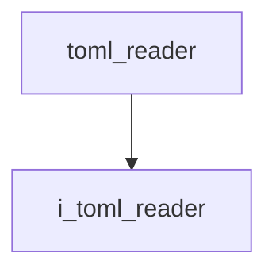

# TOML Reader

- **Class**: `toml_reader`
- **Namespace**: `acs::utility`
- **Include**: `#include "utility/implementation/toml_reader.h"`

## Overview

Concrete implementation of [`i_toml_reader`](../interfaces/i_toml_reader.md). Parses TOML configuration files and provides access to the parsed table.

## Inheritance Diagram

### Base Diagram



## Inheritance Hierarchy

### Base Hierarchy

- [`toml_reader`](toml_reader.md)
  - [`i_toml_reader`](../interfaces/i_toml_reader.md)

## API

### Constructors
#### Default Constructor

```cpp
toml_reader();
```
Creates a TOML reader with its default configuration path.

### Public Methods

#### Implementations
- [`i_toml_reader`](../interfaces/i_toml_reader.md)
    - [`parse`](../interfaces/i_toml_reader.md#parse)
    - [`free`](../interfaces/i_toml_reader.md#free)
    - [`get_file_path`](../interfaces/i_toml_reader.md#get-file-path)
    - [`set_file_path`](../interfaces/i_toml_reader.md#set-file-path)
    - [`get_default_file_path`](../interfaces/i_toml_reader.md#get-default-file-path)
    - [`get_table_ref`](../interfaces/i_toml_reader.md#get-table-reference)
