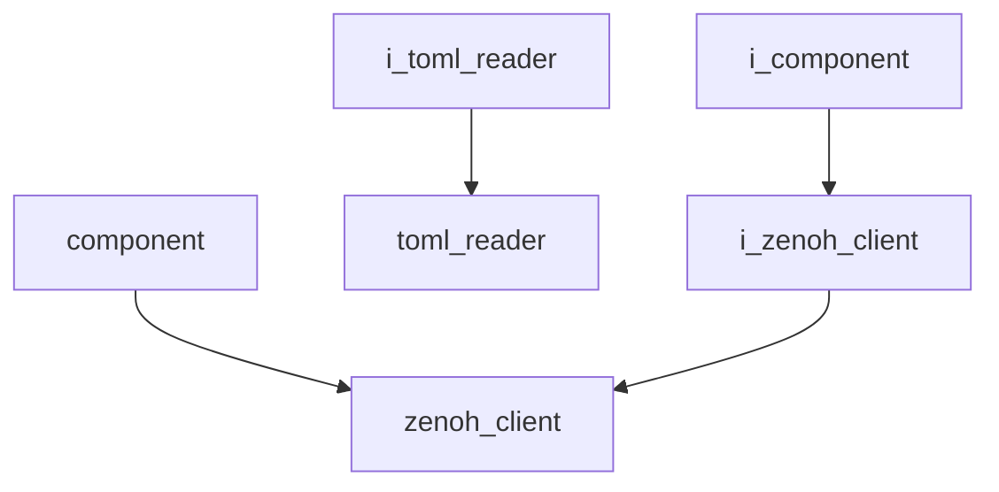

# Utility Namespace

## Overview

The `acs::utility` namespace contains helper components and interfaces for common functionality such as configuration file parsing and Zenoh communication.

## Namespace Contents

### Interfaces

- [i_toml_reader](interfaces/i_toml_reader.md)
- [i_zenoh_client](interfaces/i_zenoh_client.md)

### Implementations

- [toml_reader](implementation/toml_reader.md)
- [zenoh_client](implementation/zenoh_client.md)

## Inheritance Hierarchy

