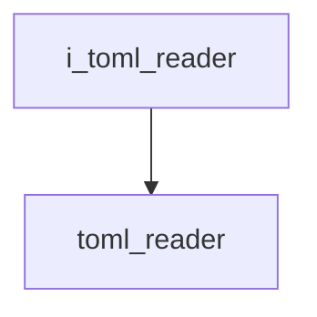

# Utility Namespace

## Overview

The `acs::utility` namespace contains helper components and interfaces for common functionality such as configuration file parsing.

```mermaid
graph TB
    i_toml_reader["i_toml_reader"]
    toml_reader["toml_reader"]
    
    i_toml_reader --> toml_reader
```
