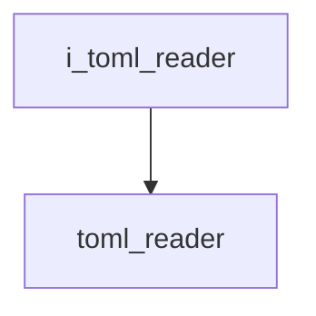

# TOML Reader Interface

- **Interface**: `i_toml_reader`
- **Namespace**: `acs::utility`
- **Include**: `#include "utility/interfaces/i_toml_reader.h"`

## Overview

Interface for reading TOML configuration files. Provides parse/free lifecycle and accessors for the file path and the parsed table.

## Inheritance Diagram

### Base Diagram


### Derived Diagram



## Inheritance Hierarchy

### Derived Hierarchy

- [`i_toml_reader`](i_toml_reader.md)
  - [`toml_reader`](../implementation/toml_reader.md)

## API

### Public Methods
#### Parse

```cpp
virtual void parse() = 0;
```
Parses the configuration file.

!!! note
    Pure virtual method, must be implemented by derived classes.
#### Free

```cpp
virtual void free() = 0;
```
Releases the parsed configuration data.

!!! note
    Pure virtual method, must be implemented by derived classes.
#### Get File Path

```cpp
[[nodiscard]] virtual std::string_view get_file_path() const noexcept = 0;
```
Returns the file path.

!!! note
    Pure virtual method, must be implemented by derived classes.
#### Set File Path

```cpp
virtual void set_file_path(std::string_view file_path) = 0;
```
Sets the file path.

##### Parameters
- `file_path`: The file path.

!!! note
    Pure virtual method, must be implemented by derived classes.
#### Get Default File Path

```cpp
[[nodiscard]] virtual std::string_view get_default_file_path() const noexcept = 0;
```
Returns the default file path.

!!! note
    Pure virtual method, must be implemented by derived classes.
#### Get Table Reference

```cpp
[[nodiscard]] virtual toml::table &get_table_ref() = 0;
```
Returns a reference to the parsed TOML table.

!!! note
    Pure virtual method, must be implemented by derived classes.
