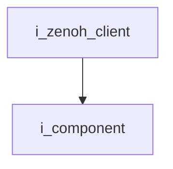
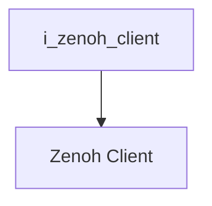

`Interface`

# Zenoh Client

- **Interface**: `i_zenoh_client`
- **Namespace**: `acs::utility`
- **Include**: `#include "utility/interfaces/i_zenoh_client.h"`

## Overview

Interface for zenoh client.

## Inheritance Diagram

### Base Diagram



### Derived Diagram



## Inheritance Hierarchy

### Base Hierarchy

- [`i_zenoh_client`](i_zenoh_client.md)
  - [`i_component`](../../core/interfaces/i_component.md)

### Derived Hierarchy

- [`i_zenoh_client`](i_zenoh_client.md)
  - [`Zenoh Client`](../implementation/zenoh_client.md)

## API

### Public Methods
#### Get Address

```cpp
[[nodiscard]] virtual std::string_view get_address() const = 0;
```
Returns the address.

!!! note
    Pure virtual method, must be implemented by derived classes.
#### Set Address

```cpp
virtual void set_address(std::string_view address) = 0;
```
Sets the address.

##### Parameters
- `address`: The address.

!!! note
    Pure virtual method, must be implemented by derived classes.
#### Get Port

```cpp
[[nodiscard]] virtual int get_port() const = 0;
```
Returns the port.

!!! note
    Pure virtual method, must be implemented by derived classes.
#### Set Port

```cpp
virtual void set_port(int port) = 0;
```
Sets the port.

##### Parameters
- `port`: The port.

!!! note
    Pure virtual method, must be implemented by derived classes.
#### Get Session Pointer

```cpp
[[nodiscard]] virtual zenoh::Session *get_session_ptr() = 0;
```
Returns the session pointer.

!!! note
    Pure virtual method, must be implemented by derived classes.
#### Get Config Pointer

```cpp
[[nodiscard]] virtual zenoh::Config *get_config_ptr() const = 0;
```
Returns the config pointer.

!!! note
    Pure virtual method, must be implemented by derived classes.
