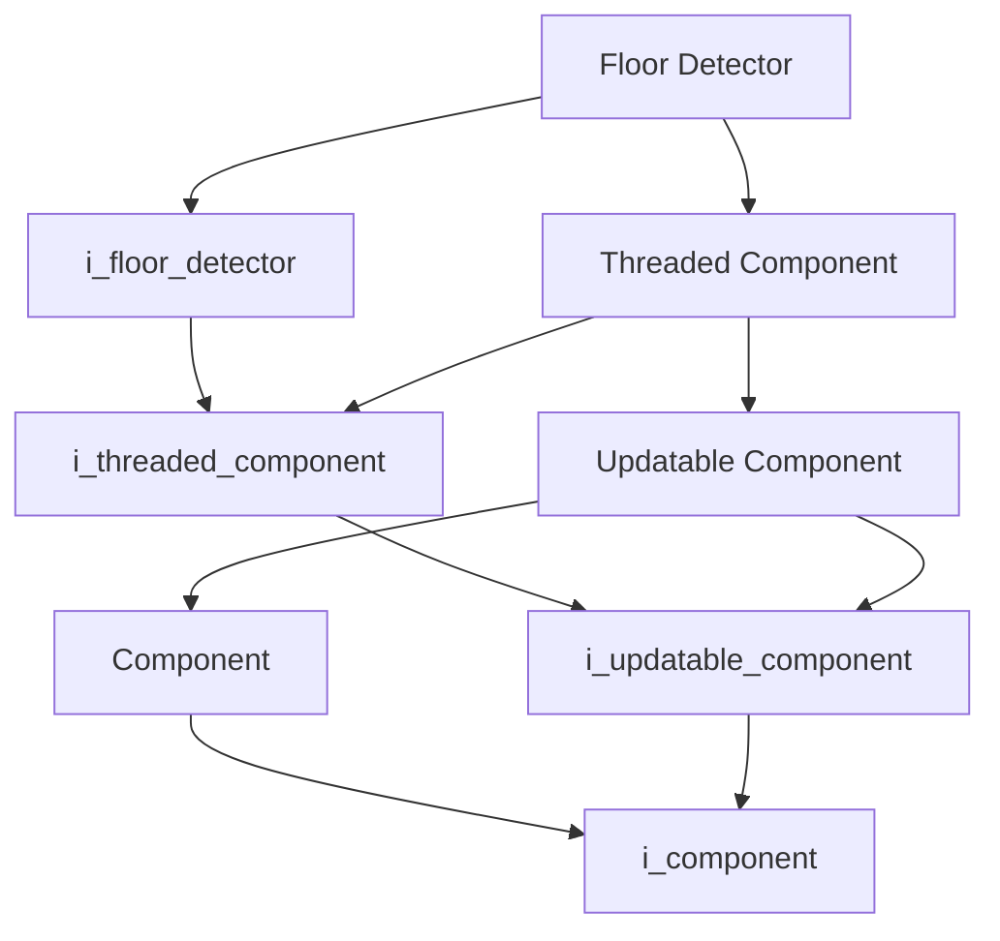
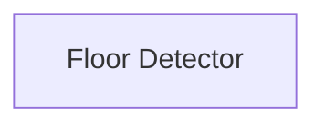

# Floor Detector

- **Class**: `floor_detector`
- **Namespace**: `acs::vision`
- **Include**: `#include "vision/implementation/detection/floor_detector.h"`

## Overview

Threaded component that detects the floor plane from ZED depth data. Extends [`threaded_component`](../../../core/implementation/threaded_component.md) and implements [`i_floor_detector`](../../interfaces/detection/i_floor_detector.md).

## Inheritance Diagram

### Base Diagram



### Derived Diagram



## Inheritance Hierarchy

### Base Hierarchy

- [`Floor Detector`](floor_detector.md)
  - [`i_floor_detector`](../../interfaces/detection/i_floor_detector.md)
    - [`i_threaded_component`](../../../core/interfaces/i_threaded_component.md)
      - [`i_updatable_component`](../../../core/interfaces/i_updatable_component.md)
        - [`i_component`](../../../core/interfaces/i_component.md)
  - [`Threaded Component`](../../../core/implementation/threaded_component.md)
    - [`i_threaded_component`](../../../core/interfaces/i_threaded_component.md)
      - [`i_updatable_component`](../../../core/interfaces/i_updatable_component.md)
        - [`i_component`](../../../core/interfaces/i_component.md)
    - [`Updatable Component`](../../../core/implementation/updatable_component.md)
      - [`Component`](../../../core/implementation/component.md)
        - [`i_component`](../../../core/interfaces/i_component.md)
      - [`i_updatable_component`](../../../core/interfaces/i_updatable_component.md)
        - [`i_component`](../../../core/interfaces/i_component.md)

## API

### Constructors
#### Constructor

```cpp
explicit floor_detector(std::string_view name,
                        std::shared_ptr<utility::i_toml_reader> toml_reader_ptr,
                        std::shared_ptr<i_zed_camera> camera_ptr);
```
Creates a floor detector with the specified name.

##### Parameters
- `name`: The name of the component.
- `toml_reader_ptr`: A shared pointer to a TOML reader for configuration.
- `camera_ptr`: Shared pointer to the zed camera.

### Public Methods

#### Implementations
- [`i_floor_detector`](../../interfaces/detection/i_floor_detector.md)
    - [`get_detected_floor_plane`](../../interfaces/detection/i_floor_detector.md#get-detected-floor-plane)
    - [`get_plane_equation`](../../interfaces/detection/i_floor_detector.md#get-plane-equation)
    - [`get_is_floor_detected`](../../interfaces/detection/i_floor_detector.md#get-is-floor-detected)

### Protected Methods
#### On Setup

```cpp
void on_setup() override;
```
Reads floor-detection configuration and initializes plane-fitting parameters.
#### On Update

```cpp
void on_update() override;
```
Runs floor-plane detection on the latest depth frame.
