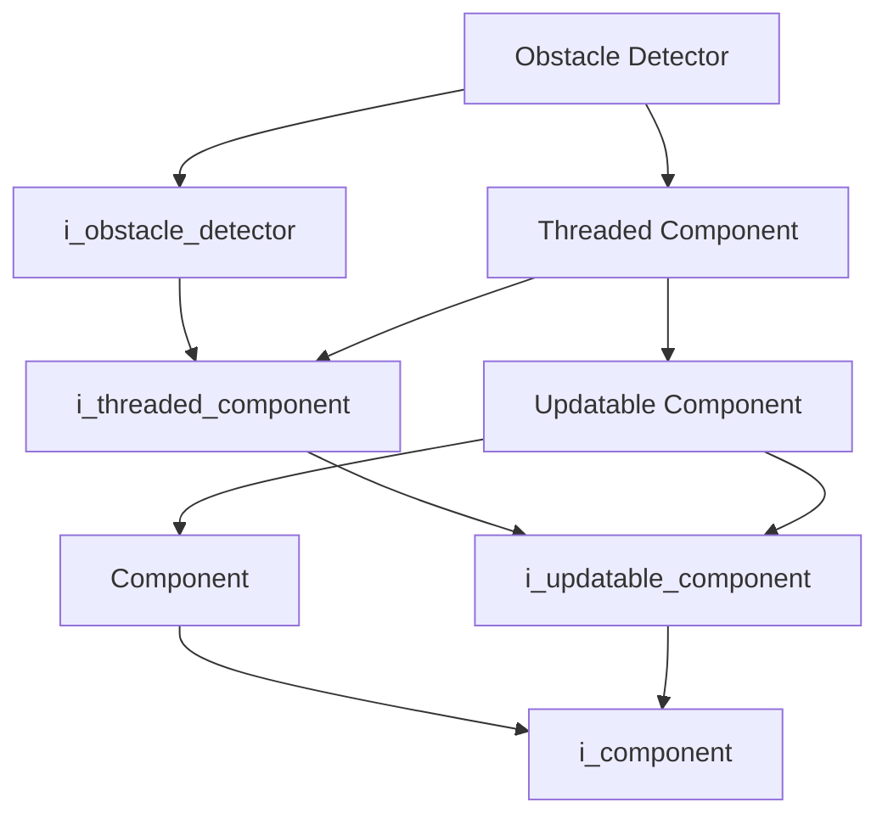
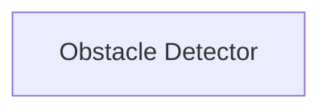

# Obstacle Detector

- **Class**: `obstacle_detector`
- **Namespace**: `acs::vision`
- **Include**: `#include "vision/implementation/detection/obstacle_detector.h"`

## Overview

Threaded component that detects obstacles using depth data and floor geometry. Extends [`threaded_component`](../../../core/implementation/threaded_component.md) and implements [`i_obstacle_detector`](../../interfaces/detection/i_obstacle_detector.md), exposing thresholds, contour data, and bounding boxes.

## Inheritance Diagram

### Base Diagram



### Derived Diagram



## Inheritance Hierarchy

### Base Hierarchy

- [`Obstacle Detector`](obstacle_detector.md)
  - [`i_obstacle_detector`](../../interfaces/detection/i_obstacle_detector.md)
    - [`i_threaded_component`](../../../core/interfaces/i_threaded_component.md)
      - [`i_updatable_component`](../../../core/interfaces/i_updatable_component.md)
        - [`i_component`](../../../core/interfaces/i_component.md)
  - [`Threaded Component`](../../../core/implementation/threaded_component.md)
    - [`i_threaded_component`](../../../core/interfaces/i_threaded_component.md)
      - [`i_updatable_component`](../../../core/interfaces/i_updatable_component.md)
        - [`i_component`](../../../core/interfaces/i_component.md)
    - [`Updatable Component`](../../../core/implementation/updatable_component.md)
      - [`Component`](../../../core/implementation/component.md)
        - [`i_component`](../../../core/interfaces/i_component.md)
      - [`i_updatable_component`](../../../core/interfaces/i_updatable_component.md)
        - [`i_component`](../../../core/interfaces/i_component.md)

## API

### Constructors
#### Constructor

```cpp
obstacle_detector(std::string_view name,
                  std::shared_ptr<utility::i_toml_reader> toml_reader_ptr,
                  std::shared_ptr<i_zed_camera> camera,
                  std::shared_ptr<i_floor_detector> floor_detector_ptr);
```
Creates an obstacle detector with the specified name.

##### Parameters
- `name`: The name of the component.
- `toml_reader_ptr`: A shared pointer to a TOML reader for configuration.
- `camera`: Shared pointer to the zed camera.
- `floor_detector_ptr`: Shared pointer to the floor detector.

### Public Methods

#### Implementations
- [`i_obstacle_detector`](../../interfaces/detection/i_obstacle_detector.md)
    - [`get_floor_detector_ptr`](../../interfaces/detection/i_obstacle_detector.md#get-floor-detector-pointer)
    - [`get_obstacle_min_range_meters`](../../interfaces/detection/i_obstacle_detector.md#get-obstacle-min-range-meters)
    - [`get_obstacle_max_range_meters`](../../interfaces/detection/i_obstacle_detector.md#get-obstacle-max-range-meters)
    - [`get_obstacle_height_threshold_meters`](../../interfaces/detection/i_obstacle_detector.md#get-obstacle-height-threshold-meters)
    - [`get_contours`](../../interfaces/detection/i_obstacle_detector.md#get-contours)
    - [`get_union_box`](../../interfaces/detection/i_obstacle_detector.md#get-union-box)
    - [`get_individual_boxes`](../../interfaces/detection/i_obstacle_detector.md#get-individual-boxes)
    - [`get_last_crop`](../../interfaces/detection/i_obstacle_detector.md#get-last-crop)

### Protected Methods
#### On Setup

```cpp
void on_setup() override;
```
Reads obstacle-detection thresholds and configuration parameters.
#### On Update

```cpp
void on_update() override;
```
Performs obstacle detection using depth data and floor-plane information.
