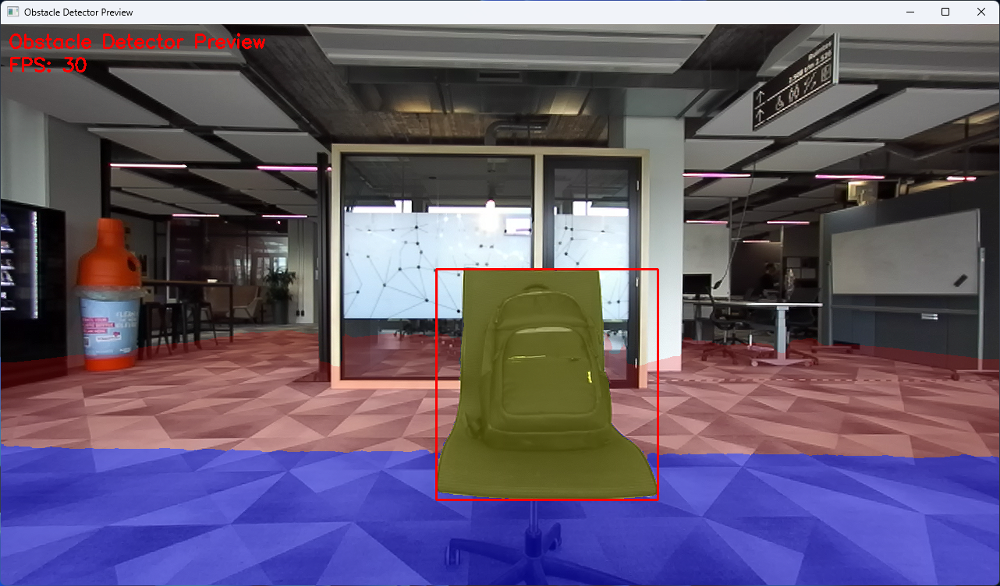
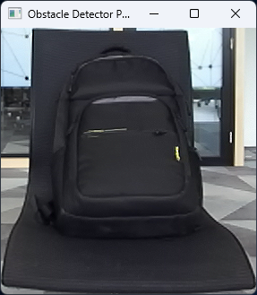

# Obstacle Detector Preview

- **Class**: `obstacle_detector_preview`
- **Namespace**: `acs::vision`
- **Include**: `#include "vision/implementation/previews/obstacle_detector_preview.h"`

## Overview

Threaded preview component that visualizes obstacle detection outputs. This class extends [`threaded_component`](../../../core/implementation/threaded_component.md) and depends on an [`i_zed_camera`](../../interfaces/i_zed_camera.md) source and an [`obstacle_detector`](../detection/obstacle_detector.md).

### Visualization



Obstacle annotations overlaid on the camera feed preview.

- **Blue Overlay**: In-range floor plane.
- **Red Overlay**: Out-of-range floor plane.
- **Yellow Overlay**: Detected obstacle contours.
- **Red Bounding Box**: Bounding box around detected obstacles.

### Cutout Visualization



Cutout visualization only showing the detected obstacle(s).

## API

### Constructors

#### Constructor

```cpp
obstacle_detector_preview(std::string_view name, std::shared_ptr<i_zed_camera> camera_ptr, std::shared_ptr<obstacle_detector> detector_ptr);
```
Creates an obstacle preview component with camera and detector dependencies.

##### Parameters
- `name`: The name of the component.
- `camera_ptr`: Shared pointer to the camera source.
- `detector_ptr`: Shared pointer to the obstacle detector.

### Protected Methods

#### On Setup

```cpp
void on_setup() override;
```
Initializes the preview window and visualization settings.

#### On Update

```cpp
void on_update() override;
```
Displays the camera frame with obstacle detection overlays.

#### On Teardown

```cpp
void on_teardown() override;
```
Closes the preview window and releases resources.
