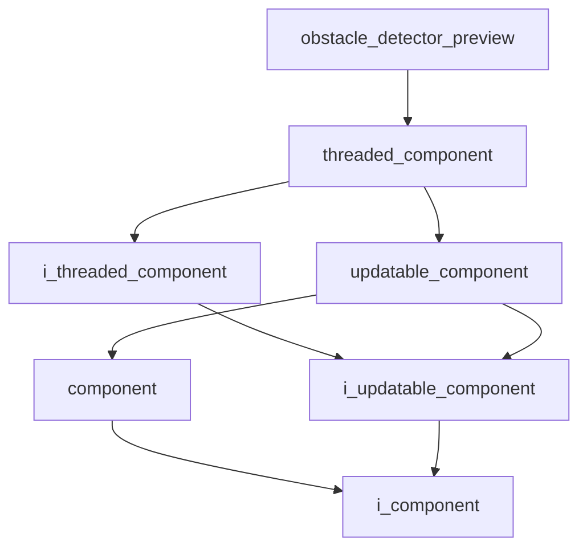

# Obstacle Detector Preview

- **Class**: `obstacle_detector_preview`
- **Namespace**: `acs::vision`
- **Include**: `#include "vision/implementation/previews/obstacle_detector_preview.h"`

## Overview

Threaded preview component that visualises obstacle detection outputs. Extends [`threaded_component`](../../../core/implementation/threaded_component.md) and depends on an [`i_zed_camera`](../../interfaces/i_zed_camera.md) and an [`i_obstacle_detector`](../../interfaces/detection/i_obstacle_detector.md).

## Inheritance Diagram

### Base Diagram



## Inheritance Hierarchy

### Base Hierarchy

- [`obstacle_detector_preview`](obstacle_detector_preview.md)
  - [`threaded_component`](../../../core/implementation/threaded_component.md)
    - [`i_threaded_component`](../../../core/interfaces/i_threaded_component.md)
      - [`i_updatable_component`](../../../core/interfaces/i_updatable_component.md)
        - [`i_component`](../../../core/interfaces/i_component.md)
    - [`updatable_component`](../../../core/implementation/updatable_component.md)
      - [`component`](../../../core/implementation/component.md)
        - [`i_component`](../../../core/interfaces/i_component.md)
      - [`i_updatable_component`](../../../core/interfaces/i_updatable_component.md)
        - [`i_component`](../../../core/interfaces/i_component.md)

## API

### Constructors
#### Constructor

```cpp
obstacle_detector_preview(std::string_view name,
                          std::shared_ptr<utility::i_toml_reader> toml_reader_ptr,
                          std::shared_ptr<i_zed_camera> camera_ptr,
                          std::shared_ptr<i_obstacle_detector> obstacle_detector_ptr);
```
Creates an obstacle detector preview with the specified name.

##### Parameters
- `name`: The name of the component.
- `toml_reader_ptr`: A shared pointer to a TOML reader for configuration.
- `camera_ptr`: Shared pointer to the zed camera.
- `obstacle_detector_ptr`: Shared pointer to the obstacle detector.

### Protected Methods
#### On Setup

```cpp
void on_setup() override;
```
Initializes the preview window and visualization settings.
#### On Update

```cpp
void on_update() override;
```
Displays the camera frame with obstacle detection overlays.
#### On Teardown

```cpp
void on_teardown() override;
```
Closes the preview window and releases resources.
