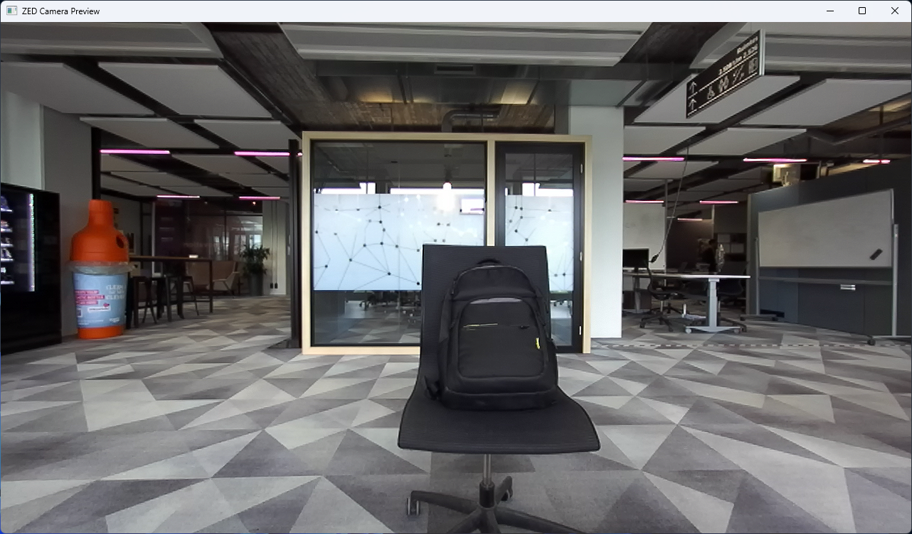

# ZED Camera Preview

- Class: `zed_camera_preview`
- Namespace: `acs::vision`
- Include: `#include "vision/implementation/previews/zed_camera_preview.h"`

## Overview

Threaded preview component that displays camera output frames. This class extends [`threaded_component`](../../../core/implementation/threaded_component.md) and depends on an [`i_zed_camera`](../../interfaces/i_zed_camera.md) source.

## Visualization



Real-time preview of the ZED camera feed, showing the latest color frame captured by the camera.

## API

### Constructors

#### Constructor

```cpp
zed_camera_preview(std::string_view name,
                   std::shared_ptr<utility::toml_reader> toml_reader_ptr,
                   std::shared_ptr<i_zed_camera> camera_ptr);
```
Creates a camera preview component with a shared camera dependency.

##### Parameters
- `name`: The name of the component.
- `toml_reader_ptr`: A shared pointer to a TOML reader for configuration.
- `camera_ptr`: Shared pointer to the camera source.

### Protected Methods

#### On Setup

```cpp
void on_setup() override;
```
Initializes the preview window and visualization settings.

#### On Update

```cpp
void on_update() override;
```
Displays the current camera frame in the preview window.

#### On Teardown

```cpp
void on_teardown() override;
```
Closes the preview window and releases resources.

