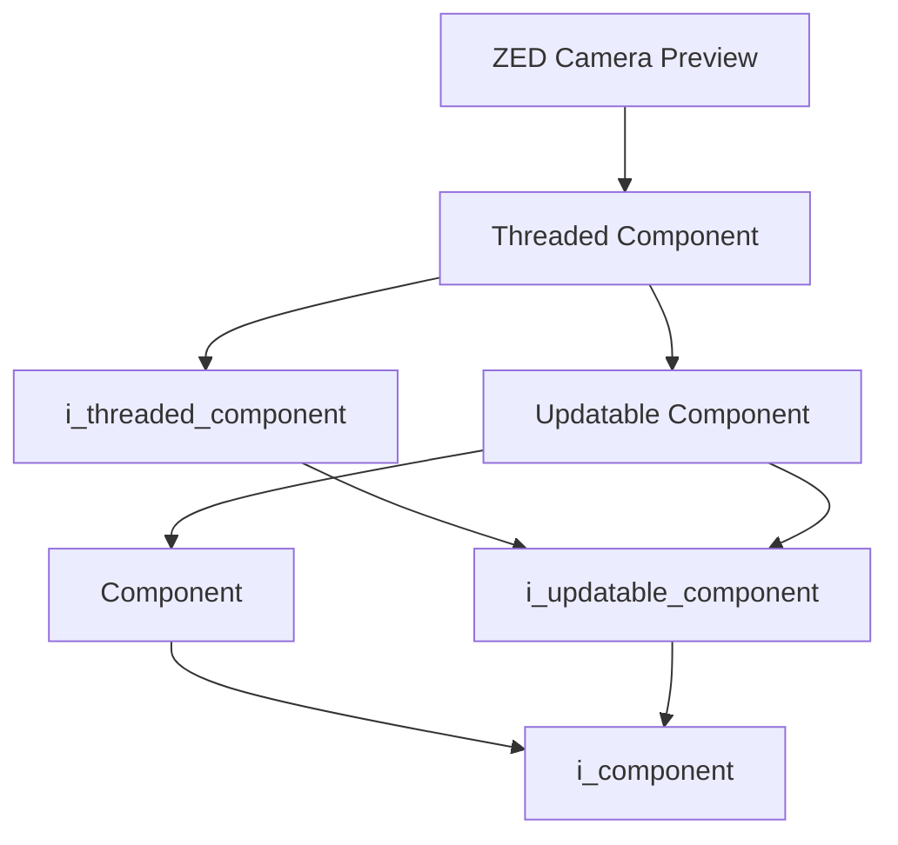
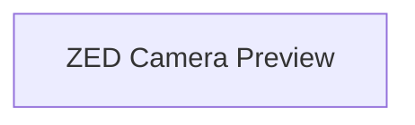

# ZED Camera Preview

- **Class**: `zed_camera_preview`
- **Namespace**: `acs::vision`
- **Include**: `#include "vision/implementation/previews/zed_camera_preview.h"`

## Overview

Threaded preview component that displays the live ZED camera feed. Extends [`threaded_component`](../../../core/implementation/threaded_component.md).

## Inheritance Diagram

### Base Diagram



### Derived Diagram



## Inheritance Hierarchy

### Base Hierarchy

- [`ZED Camera Preview`](zed_camera_preview.md)
  - [`Threaded Component`](../../../core/implementation/threaded_component.md)
    - [`i_threaded_component`](../../../core/interfaces/i_threaded_component.md)
      - [`i_updatable_component`](../../../core/interfaces/i_updatable_component.md)
        - [`i_component`](../../../core/interfaces/i_component.md)
    - [`Updatable Component`](../../../core/implementation/updatable_component.md)
      - [`Component`](../../../core/implementation/component.md)
        - [`i_component`](../../../core/interfaces/i_component.md)
      - [`i_updatable_component`](../../../core/interfaces/i_updatable_component.md)
        - [`i_component`](../../../core/interfaces/i_component.md)

## API

### Constructors
#### Constructor

```cpp
zed_camera_preview(std::string_view name,
                   std::shared_ptr<utility::i_toml_reader> toml_reader_ptr,
                   std::shared_ptr<i_zed_camera> camera_ptr);
```
Creates a zed camera preview with the specified name.

##### Parameters
- `name`: The name of the component.
- `toml_reader_ptr`: A shared pointer to a TOML reader for configuration.
- `camera_ptr`: Shared pointer to the zed camera.

### Protected Methods
#### On Setup

```cpp
void on_setup() override;
```
Initializes the preview window.
#### On Update

```cpp
void on_update() override;
```
Displays the latest color frame from the camera.
#### On Teardown

```cpp
void on_teardown() override;
```
Closes the preview window and releases resources.
