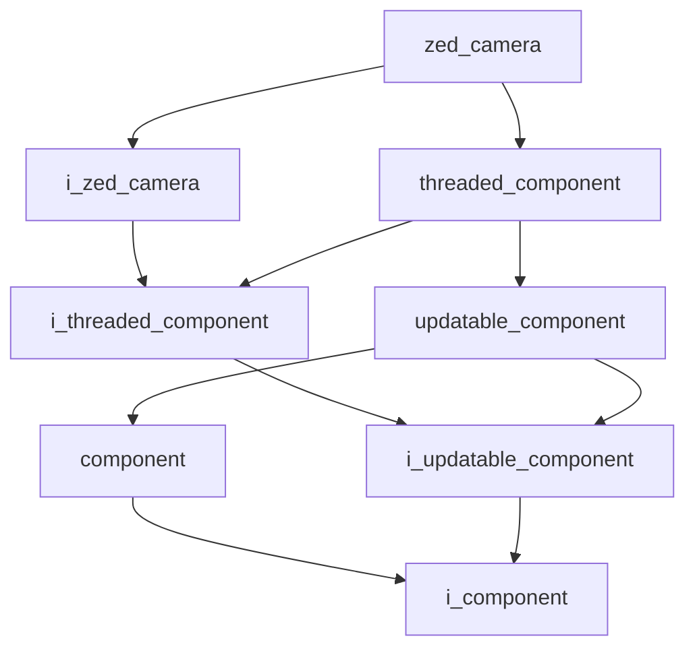

# ZED Camera

- **Class**: `zed_camera`
- **Namespace**: `acs::vision`
- **Include**: `#include "vision/implementation/zed_camera.h"`

## Overview

Concrete ZED camera component for the vision pipeline. Extends [`threaded_component`](../../core/implementation/threaded_component.md) and implements [`i_zed_camera`](../interfaces/i_zed_camera.md), managing camera setup, frame acquisition, and teardown.

## Inheritance Diagram

### Base Diagram



## Inheritance Hierarchy

### Base Hierarchy

- [`zed_camera`](zed_camera.md)
  - [`i_zed_camera`](../interfaces/i_zed_camera.md)
    - [`i_threaded_component`](../../core/interfaces/i_threaded_component.md)
      - [`i_updatable_component`](../../core/interfaces/i_updatable_component.md)
        - [`i_component`](../../core/interfaces/i_component.md)
  - [`threaded_component`](../../core/implementation/threaded_component.md)
    - [`i_threaded_component`](../../core/interfaces/i_threaded_component.md)
      - [`i_updatable_component`](../../core/interfaces/i_updatable_component.md)
        - [`i_component`](../../core/interfaces/i_component.md)
    - [`updatable_component`](../../core/implementation/updatable_component.md)
      - [`component`](../../core/implementation/component.md)
        - [`i_component`](../../core/interfaces/i_component.md)
      - [`i_updatable_component`](../../core/interfaces/i_updatable_component.md)
        - [`i_component`](../../core/interfaces/i_component.md)

## API

### Constructors
#### Constructor

```cpp
explicit zed_camera(std::string_view name, std::shared_ptr<utility::i_toml_reader> toml_reader_ptr);
```
Creates a zed camera with the specified name.

##### Parameters
- `name`: The name of the component.
- `toml_reader_ptr`: A shared pointer to a TOML reader for configuration.

### Public Methods

#### Implementations
- [`i_zed_camera`](../interfaces/i_zed_camera.md)
    - [`get_color_frame`](../interfaces/i_zed_camera.md#get-color-frame)
    - [`get_depth_frame`](../interfaces/i_zed_camera.md#get-depth-frame)
    - [`get_fps`](../interfaces/i_zed_camera.md#get-fps)
    - [`get_dropped_frames_count`](../interfaces/i_zed_camera.md#get-dropped-frames-count)
    - [`get_is_opened`](../interfaces/i_zed_camera.md#get-is-opened)
    - [`get_native_camera_ref`](../interfaces/i_zed_camera.md#get-native-camera-reference)

### Protected Methods
#### On Setup

```cpp
void on_setup() override;
```
Initializes the ZED camera hardware and runtime parameters.
#### On Update

```cpp
void on_update() override;
```
Captures frames from the camera and updates internal matrices.
#### On Teardown

```cpp
void on_teardown() override;
```
Closes the ZED camera and releases resources.
