# Vision Namespace

## Overview

The `acs::vision` namespace contains components for camera access, scene understanding, and visualization. It implements the detection pipeline for obstacles using ZED stereo camera hardware.

## Namespace Contents

### Interfaces

- [i_floor_detector](interfaces/detection/i_floor_detector.md)
- [i_obstacle_detector](interfaces/detection/i_obstacle_detector.md)
- [i_zed_camera](interfaces/i_zed_camera.md)

### Implementations

- [floor_detector](implementation/detection/floor_detector.md)
- [matrix_converter](implementation/helpers/matrix_converter.md)
- [obstacle_detector](implementation/detection/obstacle_detector.md)
- [obstacle_detector_preview](implementation/previews/obstacle_detector_preview.md)
- [zed_camera](implementation/zed_camera.md)
- [zed_camera_preview](implementation/previews/zed_camera_preview.md)

## Inheritance Hierarchy

```mermaid
graph TD
    C__DEV_Visual_Studio_Projects_autonomous_control_system_wiki_docs_codebase_namespaces_core_implementation_threaded_component["threaded_component"]
    C__DEV_Visual_Studio_Projects_autonomous_control_system_wiki_docs_codebase_namespaces_core_interfaces_i_threaded_component["i_threaded_component"]
    C__DEV_Visual_Studio_Projects_autonomous_control_system_wiki_docs_codebase_namespaces_vision_implementation_detection_floor_detector["floor_detector"]
    C__DEV_Visual_Studio_Projects_autonomous_control_system_wiki_docs_codebase_namespaces_vision_implementation_detection_obstacle_detector["obstacle_detector"]
    C__DEV_Visual_Studio_Projects_autonomous_control_system_wiki_docs_codebase_namespaces_vision_implementation_helpers_matrix_converter["matrix_converter"]
    C__DEV_Visual_Studio_Projects_autonomous_control_system_wiki_docs_codebase_namespaces_vision_implementation_previews_obstacle_detector_preview["obstacle_detector_preview"]
    C__DEV_Visual_Studio_Projects_autonomous_control_system_wiki_docs_codebase_namespaces_vision_implementation_previews_zed_camera_preview["zed_camera_preview"]
    C__DEV_Visual_Studio_Projects_autonomous_control_system_wiki_docs_codebase_namespaces_vision_implementation_zed_camera["zed_camera"]
    C__DEV_Visual_Studio_Projects_autonomous_control_system_wiki_docs_codebase_namespaces_vision_interfaces_detection_i_floor_detector["i_floor_detector"]
    C__DEV_Visual_Studio_Projects_autonomous_control_system_wiki_docs_codebase_namespaces_vision_interfaces_detection_i_obstacle_detector["i_obstacle_detector"]
    C__DEV_Visual_Studio_Projects_autonomous_control_system_wiki_docs_codebase_namespaces_vision_interfaces_i_zed_camera["i_zed_camera"]
    C__DEV_Visual_Studio_Projects_autonomous_control_system_wiki_docs_codebase_namespaces_core_implementation_threaded_component --> C__DEV_Visual_Studio_Projects_autonomous_control_system_wiki_docs_codebase_namespaces_vision_implementation_detection_floor_detector
    C__DEV_Visual_Studio_Projects_autonomous_control_system_wiki_docs_codebase_namespaces_core_implementation_threaded_component --> C__DEV_Visual_Studio_Projects_autonomous_control_system_wiki_docs_codebase_namespaces_vision_implementation_detection_obstacle_detector
    C__DEV_Visual_Studio_Projects_autonomous_control_system_wiki_docs_codebase_namespaces_core_implementation_threaded_component --> C__DEV_Visual_Studio_Projects_autonomous_control_system_wiki_docs_codebase_namespaces_vision_implementation_previews_obstacle_detector_preview
    C__DEV_Visual_Studio_Projects_autonomous_control_system_wiki_docs_codebase_namespaces_core_implementation_threaded_component --> C__DEV_Visual_Studio_Projects_autonomous_control_system_wiki_docs_codebase_namespaces_vision_implementation_previews_zed_camera_preview
    C__DEV_Visual_Studio_Projects_autonomous_control_system_wiki_docs_codebase_namespaces_core_implementation_threaded_component --> C__DEV_Visual_Studio_Projects_autonomous_control_system_wiki_docs_codebase_namespaces_vision_implementation_zed_camera
    C__DEV_Visual_Studio_Projects_autonomous_control_system_wiki_docs_codebase_namespaces_core_interfaces_i_threaded_component --> C__DEV_Visual_Studio_Projects_autonomous_control_system_wiki_docs_codebase_namespaces_vision_interfaces_detection_i_floor_detector
    C__DEV_Visual_Studio_Projects_autonomous_control_system_wiki_docs_codebase_namespaces_core_interfaces_i_threaded_component --> C__DEV_Visual_Studio_Projects_autonomous_control_system_wiki_docs_codebase_namespaces_vision_interfaces_detection_i_obstacle_detector
    C__DEV_Visual_Studio_Projects_autonomous_control_system_wiki_docs_codebase_namespaces_core_interfaces_i_threaded_component --> C__DEV_Visual_Studio_Projects_autonomous_control_system_wiki_docs_codebase_namespaces_vision_interfaces_i_zed_camera
    C__DEV_Visual_Studio_Projects_autonomous_control_system_wiki_docs_codebase_namespaces_vision_interfaces_detection_i_floor_detector --> C__DEV_Visual_Studio_Projects_autonomous_control_system_wiki_docs_codebase_namespaces_vision_implementation_detection_floor_detector
    C__DEV_Visual_Studio_Projects_autonomous_control_system_wiki_docs_codebase_namespaces_vision_interfaces_detection_i_obstacle_detector --> C__DEV_Visual_Studio_Projects_autonomous_control_system_wiki_docs_codebase_namespaces_vision_implementation_detection_obstacle_detector
    C__DEV_Visual_Studio_Projects_autonomous_control_system_wiki_docs_codebase_namespaces_vision_interfaces_i_zed_camera --> C__DEV_Visual_Studio_Projects_autonomous_control_system_wiki_docs_codebase_namespaces_vision_implementation_zed_camera
```

