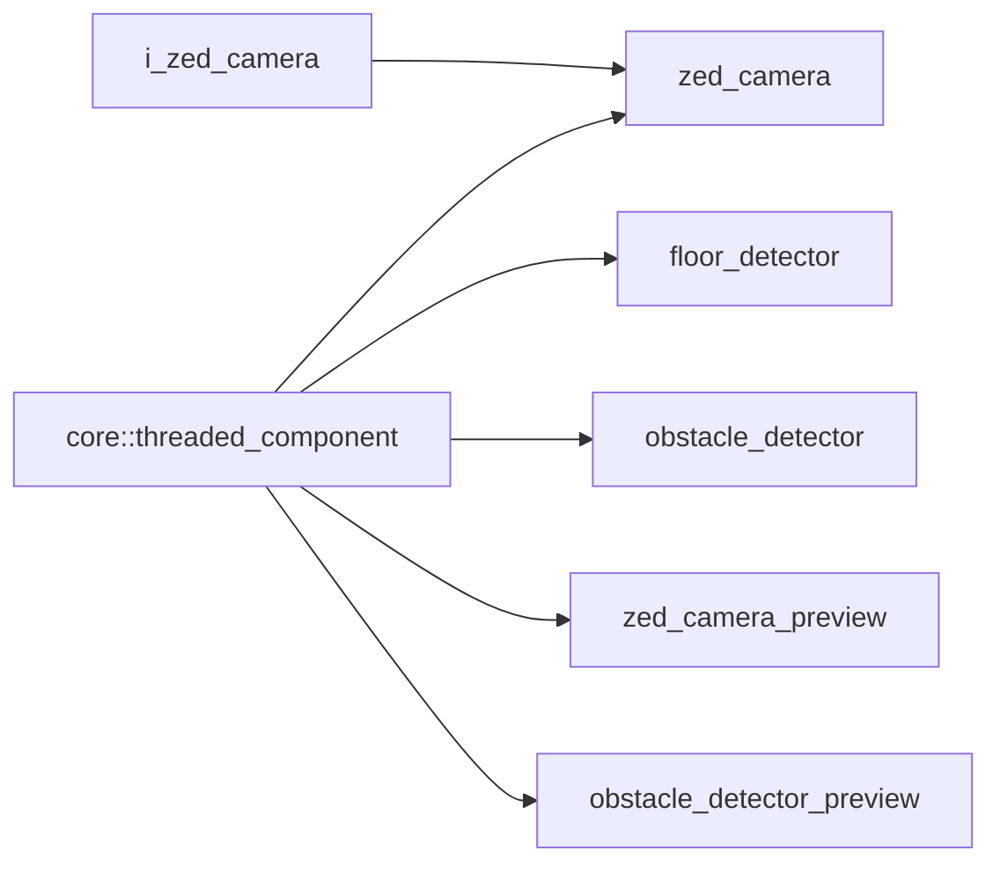
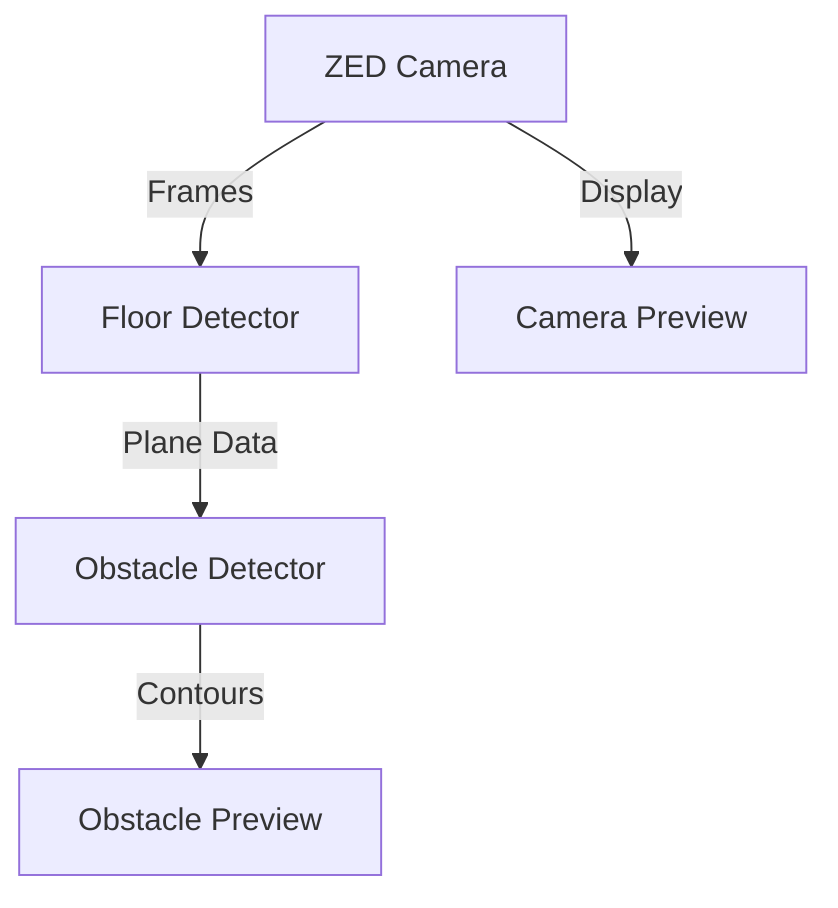

# Vision Namespace

## Overview

The `acs::vision` namespace contains components for camera access, scene understanding, and visualization. It implements the detection pipeline for obstacles using ZED stereo camera hardware.

## Inheritance Hierarchy

## Vision Pipeline Graph

