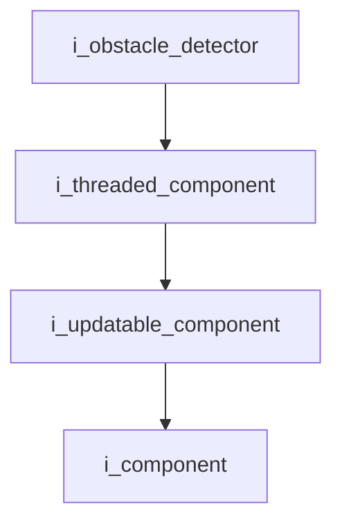
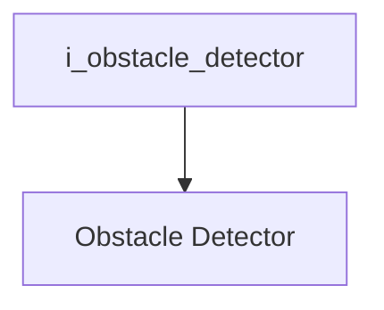

`Interface`

# Obstacle Detector

- **Interface**: `i_obstacle_detector`
- **Namespace**: `acs::vision`
- **Include**: `#include "vision/interfaces/detection/i_obstacle_detector.h"`

## Overview

Interface for obstacle detection in the vision subsystem. Extends [`i_threaded_component`](../../../core/interfaces/i_threaded_component.md) and defines accessors for detection thresholds, contour data, bounding boxes, and the linked floor detector.

## Inheritance Diagram

### Base Diagram



### Derived Diagram



## Inheritance Hierarchy

### Base Hierarchy

- [`i_obstacle_detector`](i_obstacle_detector.md)
  - [`i_threaded_component`](../../../core/interfaces/i_threaded_component.md)
    - [`i_updatable_component`](../../../core/interfaces/i_updatable_component.md)
      - [`i_component`](../../../core/interfaces/i_component.md)

### Derived Hierarchy

- [`i_obstacle_detector`](i_obstacle_detector.md)
  - [`Obstacle Detector`](../../implementation/detection/obstacle_detector.md)

## API

### Public Methods
#### Get Floor Detector Pointer

```cpp
[[nodiscard]] virtual std::shared_ptr<i_floor_detector> get_floor_detector_ptr() = 0;
```
Returns the linked floor detector.

!!! note
    Pure virtual method, must be implemented by derived classes.
#### Get Obstacle Min Range Meters

```cpp
[[nodiscard]] virtual float get_obstacle_min_range_meters() const = 0;
```
Returns the obstacle min range meters.

!!! note
    Pure virtual method, must be implemented by derived classes.
#### Get Obstacle Max Range Meters

```cpp
[[nodiscard]] virtual float get_obstacle_max_range_meters() const = 0;
```
Returns the obstacle max range meters.

!!! note
    Pure virtual method, must be implemented by derived classes.
#### Get Obstacle Height Threshold Meters

```cpp
[[nodiscard]] virtual float get_obstacle_height_threshold_meters() const = 0;
```
Returns the obstacle height threshold meters.

!!! note
    Pure virtual method, must be implemented by derived classes.
#### Get Contours

```cpp
[[nodiscard]] virtual std::vector<std::vector<cv::Point>> &get_contours() = 0;
```
Returns the detected obstacle contours.

!!! note
    Pure virtual method, must be implemented by derived classes.
#### Get Union Box

```cpp
[[nodiscard]] virtual cv::Rect &get_union_box() = 0;
```
Returns the combined bounding box enclosing all detected obstacles.

!!! note
    Pure virtual method, must be implemented by derived classes.
#### Get Individual Boxes

```cpp
[[nodiscard]] virtual std::vector<cv::Rect> &get_individual_boxes() = 0;
```
Returns the individual bounding boxes for each detected obstacle.

!!! note
    Pure virtual method, must be implemented by derived classes.
#### Get Last Crop

```cpp
[[nodiscard]] virtual cv::Mat &get_last_crop() = 0;
```
Returns the latest cropped image region corresponding to the union box.

!!! note
    Pure virtual method, must be implemented by derived classes.
