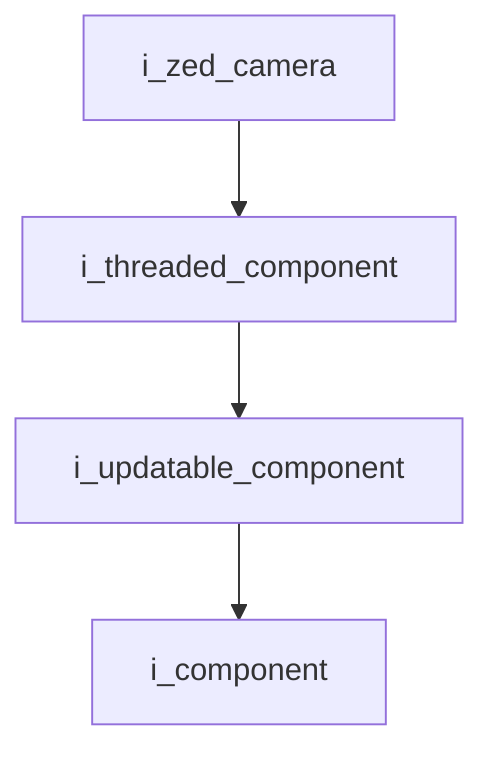
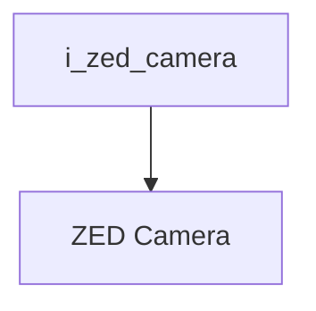

`Interface`

# ZED Camera

- **Interface**: `i_zed_camera`
- **Namespace**: `acs::vision`
- **Include**: `#include "vision/interfaces/i_zed_camera.h"`

## Overview

Interface for the ZED stereo camera. Exposes GPU-resident color and depth frames together with camera metrics and native SDK access.

## Inheritance Diagram

### Base Diagram



### Derived Diagram



## Inheritance Hierarchy

### Base Hierarchy

- [`i_zed_camera`](i_zed_camera.md)
  - [`i_threaded_component`](../../core/interfaces/i_threaded_component.md)
    - [`i_updatable_component`](../../core/interfaces/i_updatable_component.md)
      - [`i_component`](../../core/interfaces/i_component.md)

### Derived Hierarchy

- [`i_zed_camera`](i_zed_camera.md)
  - [`ZED Camera`](../implementation/zed_camera.md)

## API

### Public Methods
#### Get Color Frame

```cpp
[[nodiscard]] virtual cv::cuda::GpuMat get_color_frame() = 0;
```
Returns the color frame.

!!! note
    Pure virtual method, must be implemented by derived classes.
#### Get Depth Frame

```cpp
[[nodiscard]] virtual cv::cuda::GpuMat get_depth_frame() = 0;
```
Returns the depth frame.

!!! note
    Pure virtual method, must be implemented by derived classes.
#### Get FPS

```cpp
[[nodiscard]] virtual float get_fps() = 0;
```
Returns the FPS.

!!! note
    Pure virtual method, must be implemented by derived classes.
#### Get Dropped Frames Count

```cpp
[[nodiscard]] virtual uint32_t get_dropped_frames_count() = 0;
```
Returns the dropped frames count.

!!! note
    Pure virtual method, must be implemented by derived classes.
#### Get Is Opened

```cpp
[[nodiscard]] virtual bool get_is_opened() = 0;
```
Returns whether the camera is opened.

!!! note
    Pure virtual method, must be implemented by derived classes.
#### Get Native Camera Reference

```cpp
[[nodiscard]] virtual sl::Camera &get_native_camera_ref() = 0;
```
Returns the native camera reference.

!!! note
    Pure virtual method, must be implemented by derived classes.
